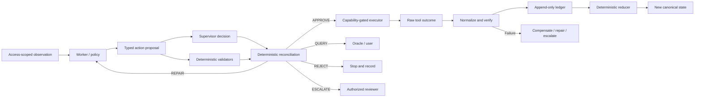

# Lead Feedback: Conditional Autonomy Architecture

## Overall assessment

The diagram is about **55% accurate conceptually**, but only **35–40% accurate** as a representation of the current runtime architecture.

Its broad story is sound:

> constrained state → worker proposal → supervisory control → authorized execution → evidence collection → offline improvement

The main issue is that several safety-critical boundaries are simplified, misplaced, or shown as less independent than they are.

## Repository alignment — September 1, 2026

The implementation now supports the architecture corrections described below:

- Schema Batches 0–3 are integrated and the complete schema gate is green.
- Fourteen of twenty Stage 1 runtime tickets are committed, pushed, and closed.
- T-10 reconciliation validators, T-16 exogenous disruptions, and T-19 deterministic generation are integrated on `main`.
- T-12 promotion validators, T-18 counterfactual safety pairs, and T-20 the solver-backed feasibility oracle are dependency-ready.
- T-13 invariant-register automation and T-21 split hygiene follow that ready wave; T-22 remains the final Stage 1 exit gate.
- The current synchronized baseline is commit `e1a7270`, with 153/153 runtime tests, 51/51 invariant cases, and the full schema and mutation gates green.

This means the deterministic control, evidence, recovery, and environment planes are substantially implemented. The offline learning and promotion plane remains an architectural target beyond the current Stage 1 runtime boundary; the immediate remaining work is promotion validation, counterfactual evaluation, solver-backed feasibility, split hygiene, and the keystone exit suite.

## What the diagram gets right

- A deterministic state/environment layer exists.
- Workers (or actor agents) produce plans and typed action proposals.
- A supervisor evaluates proposals before execution.
- External effects pass through an execution boundary and append-only ledger.
- Failures and repairs become evidence for later optimization.
- DPO can be one offline improvement method.
- Live execution and offline optimization are intentionally separated.

These points align with the formal architecture and current runtime described in [runtime/README.md](C:/Users/Owner/Documents/Codex/conditional-autonomy/runtime/README.md).

## Most important corrections

1. **The learned supervisor is not the final authority.** Its decision must be independently reconciled with deterministic evidence.
2. **Offline training cannot directly modify live safety boundaries.** Candidate changes must be evaluated, promotion-gated, versioned, and rollback-capable.

## Runtime control and validation

### 1. Supervisor decisions are richer than approve/reject

The diagram currently presents sequence scoring as only `APPROVE` / `REJECT`.

The actual decision set is:

- `APPROVE`
- `REPAIR`
- `QUERY`
- `REJECT`
- `ESCALATE`

Supervisor approval alone is not enough to execute. Deterministic evidence must also independently confirm:

- Schema validity
- Capabilities
- Preconditions
- Current state version
- Preventable invariants
- Predictive risk
- Budget and policy constraints
- Compensation prevalidation, when applicable

This deterministic validator and reconciliation layer is one of the most important elements missing from the diagram.

### 2. Execution does not go directly to success

Execution must be reconciled and audited before an effect becomes canonical truth.

### 3. Replace “optimal/sub-optimal boundary” status

Runtime boundaries should not primarily classify themselves as optimal or sub-optimal. They enforce:

- `PASS`, `FAIL`, or `UNKNOWN`
- `HARD` or `SOFT`
- `PREVENTABLE`, `PREDICTIVE`, or `DETECTABLE`
- Phase-specific dispositions such as `REPAIR`, `ESCALATE`, or `QUARANTINE`

Optimality is only one evaluation dimension. Safety, regression protection, calibration, task success, recovery, and cost are recorded separately.

## State, evidence, and action contracts

### 4. Replace Pydantic as the state-engine abstraction

The contract boundary uses:

- Pinned JSON Schema Draft 2020-12 validation
- Canonical JSON
- Stable IDs
- Content hashes
- Defensive copies

Use **“Versioned JSON Schema contracts and deterministic reducer”** instead of “Pydantic Models.”

The environment is not identical to the ledger. The ledger is the ordered event history from which canonical state is reconstructed.

### 5. De-emphasize conversation history

Conversation state exists—especially for the deterministic oracle/user simulator—but it is not one of the three primary foundations.

More central components are:

- Canonical state
- Append-only event and artifact ledger
- Access-scoped observation projector
- Constraints and permissions
- Exogenous event space
- Typed action contracts
- Outcome and evidence records

Place “conversation history” beside the oracle/user interface or trace plane instead.

### 6. Replace the action-space dial

The formal action space is:

> Finite typed action schemas plus bounded natural-language arguments

It is not a continuum from “uniform single loops” to “heterogeneous graph boundaries.” Graph structure belongs to plans, dependencies, entities, resources, or agent routing—not to the action-space definition.

## Offline learning and promotion

### 7. DPO is one option, not the engine

The post-training plane can compare:

- Prompt changes
- Supervised fine-tuning
- DPO
- Process reward models
- Offline agent RL
- On-policy agent RL
- LoRA or adapter training

Rename **“DPO Alignment Engine”** to **“Versioned Offline Training Pipeline”**, with DPO as one branch.

### 8. Do not draw a direct training-to-runtime update arrow

The current thick arrow implies that DPO directly updates the live supervisor boundary. That is specifically prohibited.

The required lifecycle is:

1. Freeze the current runtime and model versions.
2. Collect and grade traces.
3. Train a candidate offline.
4. Evaluate frozen safety, regression, calibration, effectiveness, and cost suites.
5. Promote or quarantine the candidate.
6. Retain rollback artifacts.
7. Deploy only a versioned, approved candidate.

A trained model cannot rewrite deterministic boundaries or promote itself.

## Naming and abstraction changes

### 9. Avoid “self-healing boundaries”

Plans and actions may be repaired. Failed effects may trigger compensation. Models may improve offline.

The safety boundaries themselves do not autonomously heal or mutate during execution. They are:

- Deterministic
- Versioned
- Independently tested
- Promotion-gated
- Rollback-capable

Recommended title:

> **Conditional Autonomy Runtime with Guarded Recovery and Offline Improvement**

### 10. Do not make LangGraph an architecture guarantee

LangGraph may be used as an orchestration implementation, but the contracts deliberately do not depend on it. The architecture must remain valid if another orchestrator replaces it.

Rename that layer:

> **Runtime Control and Execution Plane**

## Recommended four-plane architecture

### 1. Environment and evidence plane

- Canonical state
- Event ledger
- Observation projection
- Constraints
- Exogenous events

### 2. Runtime control plane

- Worker
- Supervisor
- Deterministic validators
- Reconciliation
- Capability-gated executor

### 3. Outcome and recovery plane

- Tool outcomes
- Verification
- Reducer
- Audit
- Compensation
- Repair
- Escalation

### 4. Offline learning and promotion plane

- Trace compiler
- Diagnostic analysis
- Candidate training
- Frozen evaluation suites
- Promotion or quarantine
- Rollback
